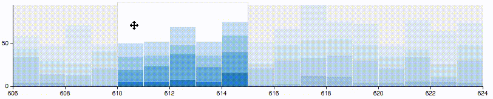

# A line chart React component

##  About

A [controlled](https://facebook.github.io/react/docs/forms.html) React component that shows a small line chart, useful for linked small multiples. Built using React and D3.js



This is a pre-release of a package belonging to the Lucify platform. It has been published to satisfy dependencies of other packages. Any APIs may change without notice.

## Installation

Add `lucify-small-line-chart` along with its dependencies (React.js and
D3.js) to your project's dependencies:

```shell
$ npm install react d3 lucify-small-line-chart --save
```

Require it in your Javascript:

#### ES5
```javascript
var LucifySmallLineChart = require('lucify-small-line-chart').default;
```

#### ES6
```javascript
import LucifySmallLineChart from 'lucify-small-line-chart';
```

Now you can use it like any other React component.

**Note:** this component has only been tested to work with React 0.13. It
should work with React 0.14 as well, but we can't confirm it at this point.

## Props

[TODO: explain these]

- **data**: React.PropTypes.arrayOf(React.PropTypes.array),
- **margin**: React.PropTypes.objectOf(React.PropTypes.number),
- **width**: React.PropTypes.number,
- **height**: React.PropTypes.number,
- **minY**: React.PropTypes.number,
- **maxY**: React.PropTypes.number,
- **xFormat**: React.PropTypes.func,
- **yFormat**: React.PropTypes.func,
- **yTickFormat**: React.PropTypes.func,
- **xTickMargin**: React.PropTypes.number,
- **xTickFormat**: React.PropTypes.func,
- **transitionLength**: React.PropTypes.number,
- **selectedX**: React.PropTypes.number,
- **handleSelectedChange**: React.PropTypes.func

## Development

Build the Javascript files into `lib/` with:

```shell
$ npm run build
```

Or build the development version and start watching for changes with:

```shell
$ npm run dev
```

To serve the example page on port 3000 and see changes live, start Gulp:

```shell
$ gulp
```

Then point your browser to http://localhost:3000/

## Developing as part of a project

To develop this component in tandem with a parent project using `npm link`,
first link this project to the parent project:

```shell
$ cd path_to_this_project
$ npm link
$ cd path_to_parent_project
$ npm link lucify-small-line-chart
```

Then link the parent project's React folder to this project:

```shell
$ cd path_to_parent_project
$ cd node_modules/react
$ npm link
$ cd path_to_this_project
$ npm link react
```

This is needed in order to prevent React from being loaded twice.

Note that if you do not use Webpack to build your parent project, the
development build will likely not work. You can build the production version
while watching for changes by running `node_modules/.bin/webpack -p --watch`.
